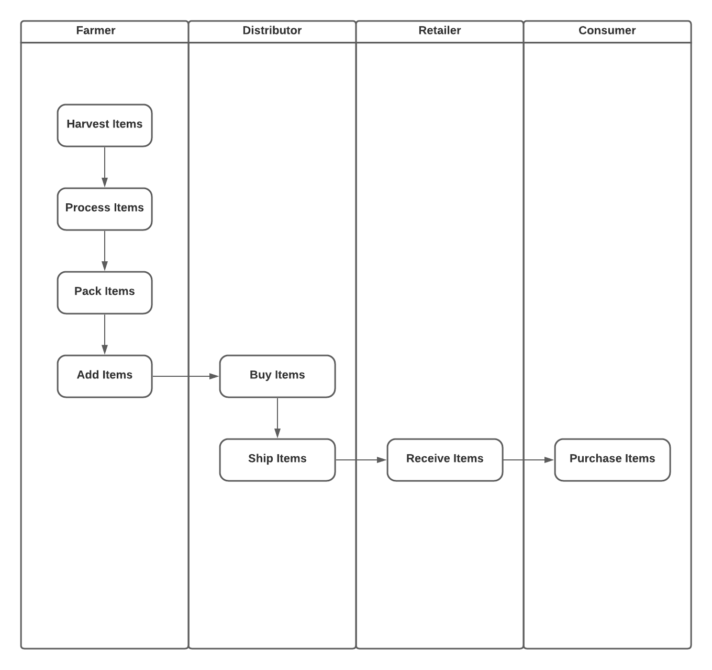
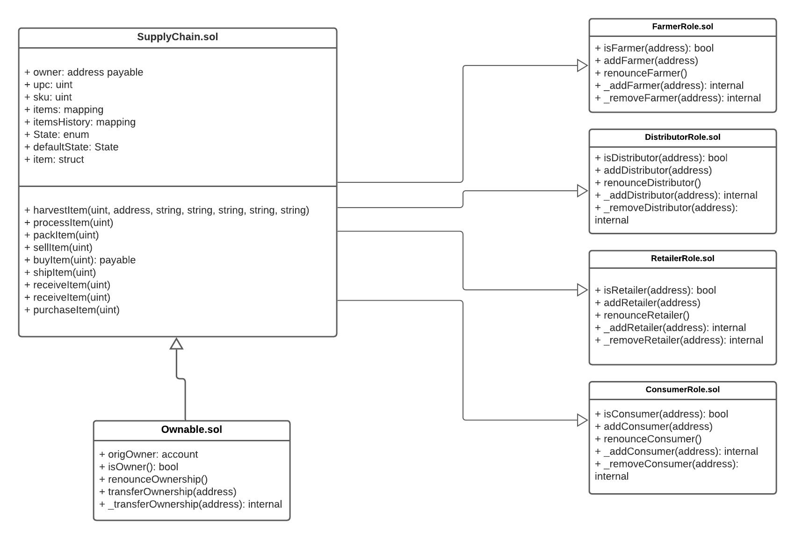
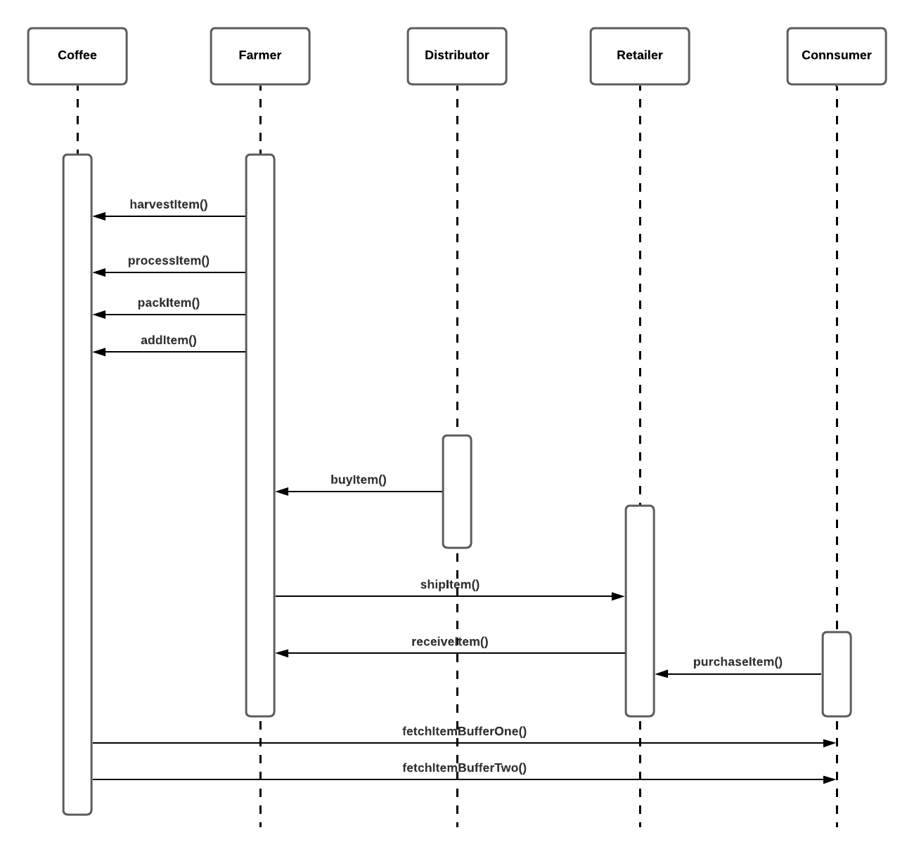
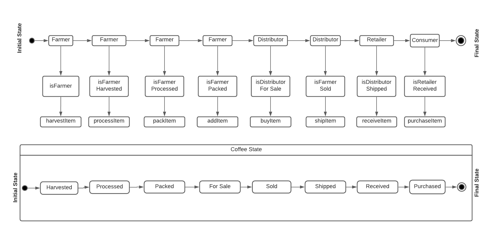

# Project: Supply chain & data auditing

An Ethereum DApp that demonstrates a Supply Chain flow from Producer to consumer.
The user story is similar to any commonly used supply chain process.
Producers (Farmers) can keep records of harvesting, processing and selling of items on the inventory
system stored on the Blockchain.
Sellers (Distributors and retailers) can add items to the inventory system stored in the Blockchain.
Buyers can purchase items from the inventory system.
Additionally Sellers can mark items as Shipped, and similarly a Buyer can mark an item as Received.

## UML Diagrams

#### Activity


#### Class


#### Sequence


#### State


## Libraries
`Web3.js`

`@truffle/hdwallet-provider@1.6.0`

## IPFS
Currently not being used for this project.

## **Contract Address:**
https://rinkeby.etherscan.io/address/0xa7FdB2dad7740697aE6ca840F3FA9495Cd332313


### Prerequisites

Please make sure you've already installed ganache-cli, Truffle and enabled MetaMask extension in your browser.

### **To Run this application**

1. Install dependencies
```bash
# install all modules listed as dependencies in package.json
npm install
```

2. Start Truffle by running
```bash
# For starting the development console
truffle develop
# truffle console

# For compiling the contracts, inside the development console, run:
# This will generate a build/contracts directory
compile

# For migrating the contract to the locally running Ethereum network, inside the development console
migrate --reset

# You can also run on a specific network (like Ganache GUI) by specifying it in truffle-config.js
# Assuming the Ganache GUI network is called ganache_gui in my truffle-config.js
truffle migrate --network ganache_gui

# For running unit tests the contract, inside the development console, run:
test
```
3. To run the front-end, launch a separate terminal window and run

```
npm run dev
```

## Built With
* [node.js version 10.15.1](https://nodejs.org/en/) - A javascript runtime engine. 
* [Ethereum](https://www.ethereum.org/) - Ethereum is a decentralized network platform that runs smart contracts.
* [Web3.js@ version 1.6.0](https://www.npmjs.com/package/web3) - A module for interacting with Contracts on the Ethereum blockchain.
* [Truffle Framework version 5.4.9](http://truffleframework.com/) - Truffle is the most popular development framework for Ethereum with a mission to make your life a whole lot easier.

